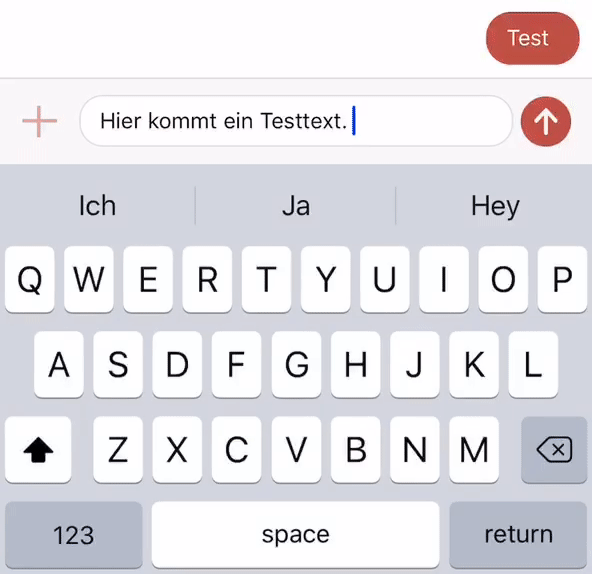

# MessageBox 

A message-entry-box for your chat application (similar to Whatsapp and Messages on iOS)



## Installation

Copy MessageBox.swift to your project - Done!


## Usage

```
let messageBox = MessageBox(leftButton, rightButton)
```

## License
See [LICENSE](LICENSE)
